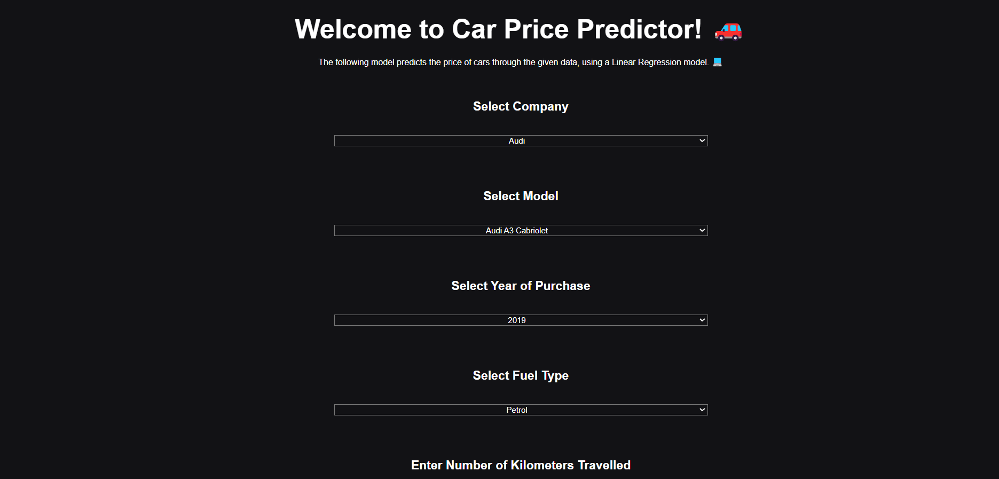

# Car Price Predictor Using Linear Regression

I recently developed a simple machine learning model utilizing linear regression, which showcases my understanding of fundamental concepts in data science. The model is designed to analyze datasets and predict outcomes based on input features, effectively demonstrating the power of regression analysis. By leveraging libraries like Scikit-learn for the machine learning component, I ensured that the model is not only efficient but also easy to integrate with a web application.

To enhance user experience, I created a front end using HTML, CSS, and JavaScript, allowing users to interact seamlessly with the model. The intuitive interface enables users to input data and receive predictions in real-time, making the application both functional and user-friendly. The integration of Flask as the backend framework provides a robust architecture for handling requests and serving the model's predictions, showcasing a complete end-to-end solution that combines machine learning with web developmen
# Tech Stack
. Front End: Html,CSS, Javascript

. backend:Flask 

. ML-MODEL:Linear Regression

## How it Works

1. Give Required Inputs 

2. Will Send the data on a pretrained model

3. fetch and show the Result

# About Linear Regression

Linear regression is a statistical method used to model the relationship between a dependent variable and one or more independent variables. It aims to find the best-fitting line that describes how the dependent variable changes as the independent variables vary. The relationship is expressed through the equation 
𝑦=𝑚𝑥+𝑏
y=mx+b, where 
𝑦
y is the predicted value, 
𝑚
m is the slope, 
𝑥
x is the independent variable, and 
𝑏
b is the y-intercept. Linear regression operates under the assumption that this relationship is linear, and it utilizes the Ordinary Least Squares (OLS) method to minimize the sum of squared differences between observed and predicted values. This versatile technique is widely applicable across various fields, such as economics, biology, and engineering, for tasks like forecasting and trend analysis, making it a fundamental tool in data analysis and predictive modeling.

# Conclusion

In conclusion, my project successfully integrates a linear regression model with a web application, showcasing the effective use of Flask for backend processing and HTML, CSS, and JavaScript for the front end. This combination not only allows users to input data and receive real-time predictions but also demonstrates my understanding of essential concepts in machine learning and web development